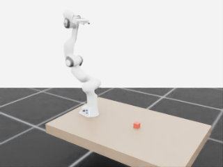
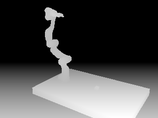

# Phase 1：Franka 操作场景验收记录

验收日期：2026-09-15  
运行设备：`cuda:0`（NVIDIA GeForce RTX 4060 Laptop GPU）  
最终状态：通过

## 本阶段范围

本阶段只验证场景、物理、坐标状态和相机，不包含控制器、抓取任务、奖励、随机化或 RL。

场景包含：

- Franka Emika Panda 机械臂和 Panda Hand；
- 带碰撞、摩擦和视觉材质的静态桌面；
- 质量为 0.10 kg 的红色动态立方体；
- 固定 320×240 RGB-D 相机；
- Franka 末端执行器 Frame Transformer；
- 地面、Dome Light 和语义标签。

## 工程实现

- `src/isaac_lab_data_engine/envs/phase1_scene.py`：场景配置。
- `scripts/run_env.py`：GUI/headless 运行、状态读取和自动验收。
- `pyproject.toml`：src-layout Python 包配置。
- `results/phase1/camera_rgb.png`：相机 RGB 调试帧。
- `results/phase1/camera_depth_preview.png`：归一化深度调试帧。

复用了 Isaac Lab 官方能力：

- `FRANKA_PANDA_CFG`；
- `InteractiveSceneCfg` / `InteractiveScene`；
- `RigidObjectCfg` 与 Isaac Lab sim spawner；
- `CameraCfg`；
- `FrameTransformerCfg`；
- `SimulationContext` 和 `AppLauncher`。

项目自行实现：

- 场景尺寸、位姿、材质和碰撞参数；
- 相机外参构图；
- 状态读取、shape 约束和数值有效性检查；
- 物体未穿透桌面的物理断言；
- RGB/深度调试预览输出。

## 验收命令

```powershell
conda activate isaaclab23
cd C:\Users\yjh\Desktop\work_project\ai_BOT
$env:OMNI_KIT_ACCEPT_EULA = "YES"
python scripts\run_env.py --headless --steps 120
python scripts\run_env.py --headless --steps 60 --save_camera
```

两次运行均输出 `PHASE1_VALIDATION_OK`，退出码均为 0。

## 实测结果

| 项目 | 实测结果 |
| --- | --- |
| 并行环境数 | 1 |
| 物理步数 | 120（主验收）/ 60（相机复验） |
| Robot joint position | `[1, 9]` |
| Robot joint velocity | `[1, 9]` |
| End-effector pose | `[1, 7]` |
| Object pose | `[1, 7]` |
| RGB | `[1, 240, 320, 3]`，`uint8` |
| Depth | `[1, 240, 320, 1]`，float |
| Camera intrinsics | `[1, 3, 3]` |
| Camera pose | `[1, 7]` |
| Depth 有效像素比例 | 约 50.36%（最终构图） |
| 物体最终高度 | 约 0.475 m |
| 桌面顶面高度 | 0.450 m |

立方体边长为 0.05 m，因此稳定放置时中心理论高度为 0.475 m；仿真结果与理论值一致，桌面碰撞有效。

相机内参实测为：

```text
[[366.4996,   0.0000, 160.0000],
 [  0.0000, 366.4996, 120.0000],
 [  0.0000,   0.0000,   1.0000]]
```

## 预览验收

最终 RGB 构图中可以同时看到完整 Franka、桌面和红色目标立方体；深度预览中的轮廓与 RGB 一致。





## 非阻塞警告

- Isaac Sim 内部扩展会输出若干 deprecated/performance warning，不影响本阶段运行。
- 低分辨率相机触发 DLSS 最小输入尺寸提示，但输出尺寸、类型和内容均通过检查。后续正式视觉数据生成时会单独确定渲染质量配置。
- 当前显卡驱动和 8 GB VRAM 风险继续沿用 Phase 0 记录；Phase 1 单环境 RGB-D 实测稳定。

## Phase 1 验收状态

- [x] Franka 成功加载
- [x] 桌面碰撞有效
- [x] 动态物体稳定放置
- [x] 机器人关节状态可读取
- [x] 物体 6DoF 位姿可读取
- [x] 末端执行器 6DoF 位姿可读取
- [x] RGB、Depth、相机内参和相机位姿可读取
- [x] GUI 与 headless 共用运行入口
- [x] 自动断言和干净退出

